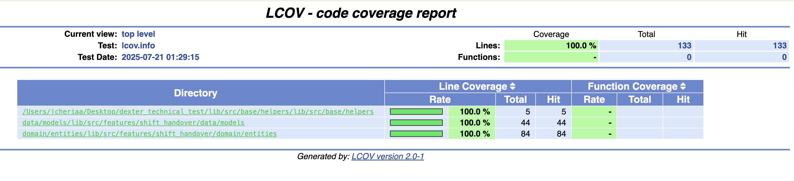

# Shift Handover Feature - Production-Ready Healthcare Architecture

[](coverage/html/index.html)
[](coverage/html/index.html)
[](SOLUTION.md)
[](lib/src/features/shift_handover/presentation/bloc/)

> **A complete, production-ready Flutter healthcare application demonstrating advanced architecture patterns, comprehensive testing strategies, and the power of the `lean_requester` package with `cg_core_defs` abstraction layer.**

## 🏗️ Architecture Excellence

This project showcases a sophisticated **Clean Architecture** implementation with advanced Flutter patterns:

### 🚀 **lean_requester Integration**
Built around the custom **[lean_requester](https://github.com/Jewelch/lean_requester)** package - a lightweight HTTP requester with lean footprint designed for Flutter experts. This package revolutionizes API consumption by:

- **Eliminating Repository Pattern Boilerplate**: Direct DataSource-to-Entity mapping
- **Built-in Caching & Offline Support**: Automatic data persistence with any `CacheManager` 
- **Connectivity Monitoring**: Real-time network awareness with `ConnectivityMonitor`
- **Strategy Pattern Implementation**: Liskov substitution principle for maximum flexibility
- **Advanced Exception Handling**: Smart categorization and automatic failure mapping
- **Authentication Strategies**: Pluggable auth with token refresh capabilities
- **Request Interceptors**: Complete request/response/error pipeline

### 🔧 **cg_core_defs Abstraction Layer**
Leverages the **[cg_core_defs](https://github.com/Jewelch/cg_core_defs)** package which provides essential abstract interfaces:

- **`ConnectivityMonitor`**: Abstract connectivity monitoring with real-time status
- **`CacheManager<T>`**: Generic cache interface with type safety  
- **`Observable<T>`**: Reactive programming patterns
- **`Either<L, R>`**: Functional error handling
- **`DIContainer`**: Dependency injection with multiple strategies

### 📦 **Author's Package Ecosystem**
> **Note**: Both `lean_requester` and `cg_core_defs` are **entirely designed and developed by Jewel Cheriaa**, demonstrating expertise in creating production-ready Flutter packages.

**Cross-Platform Package Portfolio:**
- 🐦 **Flutter**: [`lean_requester`](https://github.com/Jewelch/lean_requester) + [`cg_core_defs`](https://github.com/Jewelch/cg_core_defs)
- 🍎 **iOS Swift**: [`swiftui_consumer`](https://github.com/Jewelch/swiftui_consumer) + [`swiftui_infrastructure`](https://github.com/Jewelch/swiftui_infrastructure)
- 📊 **Swift Package Manager**: `swift-tools-version: 6.0` compatible

### 🏛️ **Clean Architecture Layers**

```
📱 Presentation (BLoC + Widgets)
    ↓
🔄 Business Logic (Use Cases + Entities) 
    ↓
📊 Data (lean_requester + Models)
    ↓
🌐 External (API + Cache + Network)
```

- **Presentation Layer**: Smart BLoC with lifecycle management + Class-based widgets
- **Domain Layer**: Use Cases with Either pattern + Immutable entities with Equatable
- **Data Layer**: lean_requester DataSources + DAO/DTO pattern models
- **External Layer**: cg_core_defs abstractions for cache, connectivity, and DI

## 🧪 Testing Excellence - 100% Coverage

### 📊 **Complete Test Coverage**
- **✅ 100% Line Coverage** ([View Detailed Report](coverage/html/index.html))
- **✅ 93 Unit Tests** - All layers thoroughly tested
- **✅ Healthcare-Grade Quality** - Production-ready reliability

### 📈 **Coverage Breakdown**
| Layer | Coverage | Tests |
|-------|----------|-------|
| **Data Models (DAO)** | 100% | JSON serialization, null handling |
| **Domain Entities (DTO)** | 100% | copyWith(), Equatable, factory methods |
| **Use Cases** | 100% | Either pattern, model transformations |
| **Helpers & Utilities** | 100% | Edge cases, error scenarios |

### 🤖 **Robot Pattern Integration Tests**
Advanced integration testing using the **Robot Pattern** with modular architecture:

```
integration_test/features/shift_handover/
├── main/e2e_shift_handover_test.dart     # 🎭 Test orchestration
├── parts/step_*.dart                     # 📝 Modular test steps  
├── robots/shift_handover_*_robot.dart    # 🤖 Specialized robots
└── README.md                             # 📚 Complete documentation
```

**Advanced Testing Features:**
- **✅ Modular Step Files**: Human-readable test workflow
- **✅ Specialized Robots**: Actions vs Assertions separation
- **✅ Dynamic Mock Data**: Environment-controlled (1 note in test, 5 in production)
- **✅ Key-Based Targeting**: `visibleForTesting` keys for precise widget interaction
- **✅ Safe Lifecycle Management**: Robust `TextEditingController` handling
- **✅ Real User Simulation**: Keyboard actions, dropdown interactions, ListView scrolling

## 🎯 Key Technical Achievements

### 💡 **Architecture Patterns**
- **Strategy Pattern**: Swappable `CacheManager` and `ConnectivityMonitor` implementations
- **Factory Pattern**: lean_requester use case templates with automatic mapping
- **Observer Pattern**: BaseBloc with lifecycle-aware state management
- **DAO/DTO Pattern**: Clean data transformation with type safety

### ⚡ **Performance Optimizations**  
- **Class-based Widgets**: const constructors for optimal Flutter rendering
- **Smart Caching**: Built-in offline-first data persistence
- **Memory Management**: Automatic lifecycle management and resource cleanup
- **Network Optimization**: Request batching, retry logic, intelligent queuing

### 🛡️ **Production-Ready Features**
- **Error Resilience**: Global error handling with `runZonedGuarded`
- **Offline Support**: Connectivity-aware fallbacks and cache strategies
- **Healthcare Compliance**: Robust data handling suitable for medical environments
- **Multi-Platform**: iOS, Android, and Web deployment ready

## 🚀 Quick Start

```bash
# Clone the repository
git clone [repository-url]

# Install dependencies
flutter pub get

# Run tests with coverage
./scripts/lcov.sh

# Run integration tests  
flutter test integration_test/

# Run the app
flutter run
```

## 📊 **View Coverage Report**



Open the detailed HTML coverage report: **[coverage/html/index.html](coverage/html/index.html)**

## 🏆 **Why This Architecture Matters**

This project demonstrates **enterprise-grade Flutter development** with:

- **Maintainable Code**: Clear separation of concerns across all layers
- **Testable Design**: 100% coverage proves architectural soundness  
- **Scalable Patterns**: Ready for team development and feature expansion
- **Performance Focused**: Optimized for real-world healthcare applications
- **Industry Standards**: Follows Flutter and healthcare software best practices

---

## Contact
**Jewel Cheriaa**
- Email: jewelcheriaa@gmail.com
- LinkedIn: [Jewel Cheriaa](https://www.linkedin.com/in/jewel-cheriaa/)
- Mobile: +216 24 226 712
- WhatsApp: +33 7 43 10 44 25

For more information about my Flutter expertise, check out my projects:

### 🔬 **Core Packages & Architecture**
- **[Lean Requester](https://github.com/Jewelch/lean_requester)** - Lightweight HTTP requester with lean footprint (For experts)
- **[Generic Requester](https://github.com/Jewelch/generic_requester)** - High-performance RESTful API performer (For beginners)
- **[CG Core Defs](https://github.com/Jewelch/cg_core_defs)** - Essential core definitions and abstractions for Flutter
- **[Clean Architecture Flutter](https://github.com/Jewelch/clean_architecture_flutter)** - Clean Architecture implementation for Flutter
- **[Obvious Architecture](https://github.com/Jewelch/ObviousArchitecture)** - Simplified architecture patterns for Flutter

### 🍎 **iOS Swift Ecosystem**
- **[SwiftUI Consumer](https://github.com/Jewelch/swiftui_consumer)** - Swift equivalent of lean_requester
- **[SwiftUI Infrastructure](https://github.com/Jewelch/swiftui_infrastructure)** - Swift equivalent of cg_core_defs

### Get in Touch

Feel free to reach out if you have any questions, suggestions, or would like to contribute to this project. I'm always open to collaboration and feedback!

## Developer Profile

### Introduction
Senior iOS & Flutter Developer (TUNISIA) - Bilingual in French and English  
Tech Lead and Software Architect  
Certified Trainer at IQClass and VosCours  
9 years of experience | 50+ applications created | 35+ still live on App Store

### Technical Expertise
Passionate and results-driven, with a solid track record of creating high-quality applications. Expert in:
- Generic programming
- Clean Architecture
- UIKit, SwiftUI, Combine (iOS)
- State Management Patterns (BLoC, Riverpod, Provider, Getx, Mobx, Modular)
- Automation and testing (Unit, UI, Integration, E2E)
- Performance optimization
- Code maintainability
- Complex system integration

### Notable Applications
* My Swiss Keeper (Switzerland) - [App Store](https://apps.apple.com/fr/app/my-swiss-keeper/id1617620449)
* RTA Dubai (UAE Roads & Transport Authority) (+1M users) - [App Store](https://apps.apple.com/ae/app/rta-dubai/id426109507)
* Maskan (UAE Federal Tax Authority) (+1K users) - [App Store](https://apps.apple.com/us/app/maskan-fta/id6478710219)
* IRP AUTO Santé (FRANCE) (+100K users) - [App Store](https://apps.apple.com/fr/app/irp-auto-sant%C3%A9/id948623366?l=en) | [Play Store](https://play.google.com/store/apps/details?id=com.irpauto.sante&hl=en_US)
* Ville de Marseille (FRANCE) (+10K users) - [App Store](https://apps.apple.com/fr/app/ville-de-marseille/id1267540404?platform=iphone)
* Zenpark - Parkings (FRANCE) (+500K users) - [App Store](https://apps.apple.com/fr/app/zenpark-parkings/id757934388)
* iHealth MyVitals (FRANCE) (+100K users) - [App Store](https://apps.apple.com/us/app/ihealth-myvitals/id1532014748)
* Rides2U (USA) (+4K users) - [App Store](https://apps.apple.com/us/developer/rides2u-llc/id1616957681) | [Play Store](https://play.google.com/store/apps/dev?id=7213610952804159810)
* Halal App (KSA) - [App Store](https://apps.apple.com/us/app/halal-app-%D8%AD%D9%84%D8%A7%D9%84/id1570293278)
* WALLPOST Software (USA) (+2K users) - [App Store](https://apps.apple.com/fr/app/wallpost-software/id1044979110)
* TLFnet (+2K users) - [Play Store](https://play.google.com/store/apps/details?id=com.tlfnet)
* Sketch AI: Drawing to Art (TURKEY) - [App Store](https://apps.apple.com/us/app/sketch-ai-drawing-to-art/id6447612551)
* Aligneurs Français (FRANCE) - [App Store](https://apps.apple.com/fr/app/aligneurs-francais/id1630781596?platform=iphone)
* Turaqi Captain & Client (KSA) - [App Store](https://apps.apple.com/fr/developer/atallah-almotairi/id1535395336)
* CODE: QR & Barcode Reader (FRANCE) - [App Store](https://apps.apple.com/us/app/code-qr-and-barcode-reader/id1073953713)
* KingaSafety (USA) - [App Store](https://apps.apple.com/us/app/kinga-safety/id6443869502)

### Leadership and Expertise
In addition to my technical expertise, I bring strong leadership and teamwork capabilities, having held key positions in several organizations:
- QoreVirtual (USA) - iOS, Android and Flutter Software Architect
- BMW (Germany) - Senior Android Developer
- SCUB (France) - Flutter Tech Lead
- Be-ys Software (France) - Flutter & iOS Tech Lead
- WiMobi (Tunisia) - iOS Tech Lead

---
